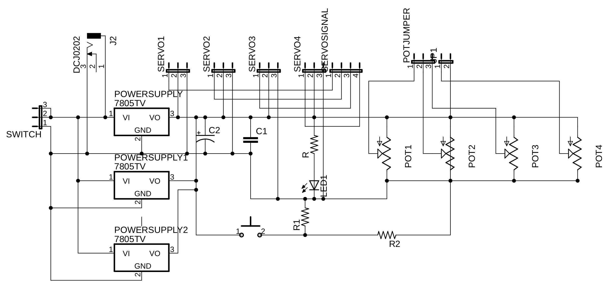
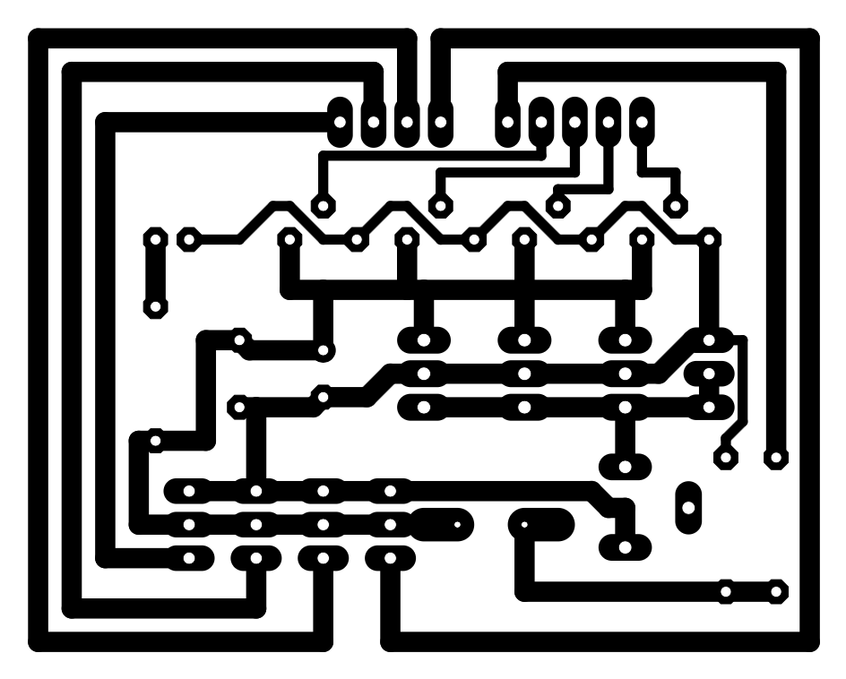
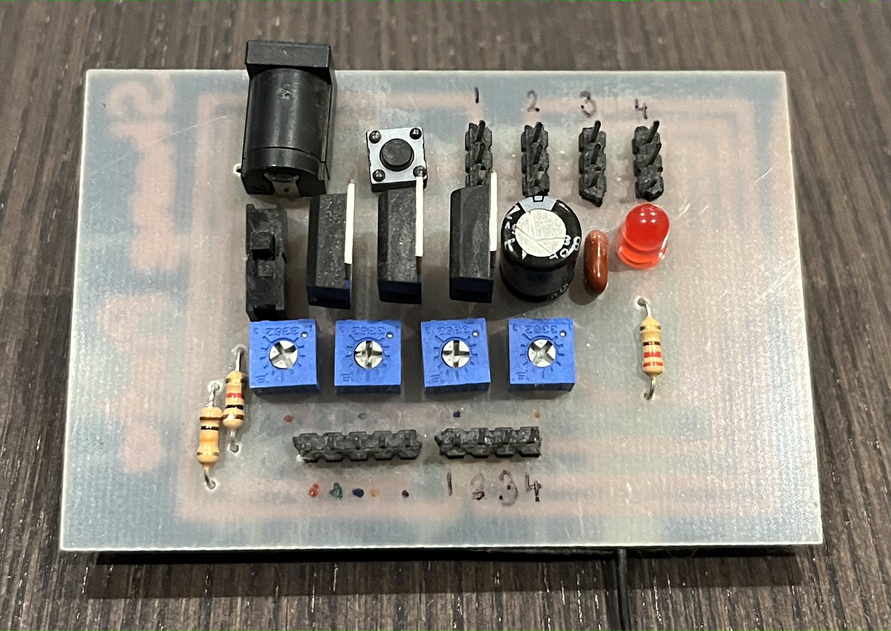

# Robotic Arm Controller

## Background

### Pulse Width Modulation (PWM)

Pule Width Modulation is a a technique of sending variable electrical signals by using digital pulses. By turning a digital output on and off at varying frequencies, an effect can be produced where the signal is recieved at a fraction of the power. For example, a digital signal which is switched between an on state and an off state in equal intervals (50% of the time) will appear to be on at half power. Using this technique of altering the frequencies of these square pulses which are digital signals, variable electrical signals can be created using digital outputs. The servo motors on the robotic arm utilize PWM signals to operate. The PWM wires consist of three different wires carrying 5V+, signal, and GND respectively.

## Robotic Arm

The robotic arm has four different degrees of freedom, each controlled by a small servo motor. These four motors control rotation on the base, extension of the arm, the height of the claws, and the opening and closing of the claws. Each servo motor has a PWM cable over which it can recieve signals from the controller.

## Controller

The controller is a custom made Printed Circuit Board (PCB) which interfaces with the robotic arm's servo motors. It is designed to be plugged into a breadboard and connect to both an external microprocessor, and the robotic arm.

### Power Supply

The controller recieves power through a barrel jack. A 9V adapter is used to plug into a 120V wall socket and supplies the board with power through the barrel jack. Most of the electronic components on the board, as well as the servo motors on the arm, run on 5V. To downstep the voltage, three 7805 voltage regulators are used in parallel to both supply 5V to the circuit, and to prevent the board from overheating from high current draw.

### Controls

The controller has four potentiometers and one button as a part of its control set. Each potentiometer is isolated on its own channel on which it can be sampled for its current value by an external microprocessor. This allows for each joint on the robotic arm to have its own separate control. The button on the circuit board can also be read for its current state. It can serve as a trigger, or as a reset button.

### Reading and Writing

The controller has multiple sets of sip pins which connect to different components. The row of five sip pins connect to the button and potentionmeters and serve as inputs for the microprocessor to sample. The row of four sip pins are output pins which the microprocessor can use to write PWM signals to the servo motors. Each pin corresponds to a specific servo motor on the arm. The last set of four rows of three sip pins are connectors for the servo motors and allow for each motor to recieve power, and its respective signal from the microprocessor.

### Schematic

### Trace Mask

### Controller Circuit Board

## Arduino

The controller board was connected to an Arduino to manage reading the controls and writing angle values to the arm's servo motors. 

### Pinouts

The Arduino is capable of reading inputted analog signals which are inputted on the analog pins. Each potentiometer on the controller board is connected to one analog pin. The programme running on the Arduino will read the analog value on the pin and use it to write an angle to the servo motor. The Arduino has multiple digital pinouts which support PWM communication. These pins were used to send PWM signals to the servo motors. They output directly onto the signal lines feeding into the servo motors. Each pinout attaches to only one signal line and controls only one motor. The button on the controller board is also attached to one digital pin so that its state can be sampled.

### Keyboard Control

In addition to being controlled via the potentiometers on the circuit board, the robotic arm can also be controlled by a computer keyboard. Once the Arduino is connected to a computer using a USB cable, keyboard inputs are sent to the Arduino over Serial communication. The programme then determines which changes must be made to which motors depending on which key was pressed.

## Revisions

 After the PCB for the controller was created, a short circuit was found to exist in the printed traces. This was manually corrected on the underside of the board. Upon using the controller with the Arduino and the robotic arm, the servo motors were found to perform in a choppy fashion. This was solved by connecting the Arduino, the controller, and the servo motors to a common ground.